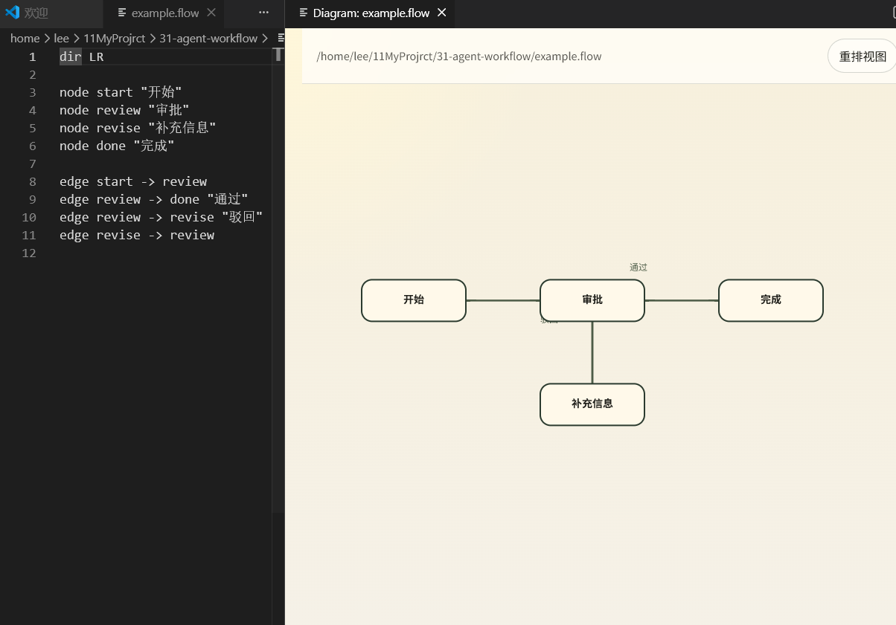
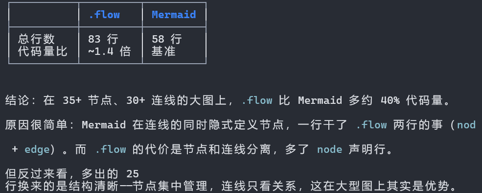

# LetusFlow

一个用于编写和预览流程图的轻量级 VS Code 插件。

使用 `.flow` 声明式语法描述图结构，使用 `.flow.layout.json` 保存稳定画布布局，让 AI 继续低成本改语义，让人类继续稳定整理空间关系。

---

## 📖 文档

- **[快速上手指南 (语法手册) →](docs/flow-syntax.md)** — 5 分钟掌握核心用法
- **[技术规范 (SPEC) →](SPEC.md)** — 供 AI 编程与深度定制参考

---

## 例子1

在一个简单的agent loop例子里面  
 .canvas 是 .flow 的约 **5.8 倍**，是 Mermaid 的约 **12 倍**
 至于.excalidraw  ,那更是复杂

## 例子2

而在.canvas上要 **700+行** ,可见其复杂度

---
## 特性

- **简洁的 DSL** — 4 个关键字（`dir` / `group` / `node` / `edge`），5 分钟上手
- **双文件模型** — `.flow` 存语义，`.flow.layout.json` 存稳定布局
- **稳定画布编辑** — 用户拖拽和整理后的空间结构会被保存
- **自动布局** — 基于 Dagre 算法提供初始布局和显式整理能力
- **实时预览** — 在 VS Code 内打开 Webview 预览，所见即所得
- **双向编辑** — 结构编辑写回 `.flow`，布局编辑写回 `.flow.layout.json`
- **间距调节** — 工具栏滑条实时调整图密度，无需修改源码
- **反馈边外侧路由** — 回环连线自动绕行主图，避免遮挡

---

## 快速开始

### 安装

```bash
npm install
npm run build
```

### 运行

1. 在 VS Code 中打开本项目目录
2. 按 `F5` 启动 Extension Host
3. 在新窗口中打开 `example.flow` 或任意 `.flow` 文件
4. `.flow` 文件会默认使用自定义编辑器 **Flow Diagram Editor** 打开
5. 如果当前文件以普通文本方式打开，执行 `Reopen Editor With...`，然后选择 **Flow Diagram Editor**

---

## .flow 语法速览

```flow
dir TD                      # 布局方向：LR(默认) | TD/TB

group tools "工具调用"       # 分组声明

node start "开始"
node decision "需要工具？" type=decision
node call "调用工具" in tools type=input
node end "结束" type=end colour=#d14d8b

edge start -> decision
edge decision -> call "是" id=e_call
edge decision -> end "否"
edge call -> decision dashed
# 注释也支持：
# edge call -> end "跳过"
```

**关键字一览：**

| 关键字 | 作用 |
|--------|------|
| `dir LR\|TD\|TB` | 设置布局方向 |
| `group <id> "标题"` | 声明分组 |
| `node <id> "标签" [in <组>] [type=<预设>] [color=<颜色名或#hex>]` | 定义节点 |
| `edge <起点> -> <终点> ["标签"] [dashed\|dotted\|dashdot] [id=<边ID>]` | 定义连线 |

完整语法参考 → [`docs/flow-syntax.md`](docs/flow-syntax.md)

---

## 截图

> 在预览面板中，拖拽节点和分组会写入 `.flow.layout.json`；点击 **整理布局** 会重算并保存布局。

---

## 技术栈

| 层级 | 技术 |
|------|------|
| 解析器 | 手写正则 + 词法分析 |
| 布局引擎 | [dagre](https://github.com/dagrejs/dagre) |
| 渲染层 | [@xyflow/react](https://reactflow.dev/) + SVG |
| 构建 | esbuild |
| 宿主 | VS Code Extension API |

---

## 开发

```bash
# 构建 webview 产物
npm run build

# 运行测试
npm test
```

---

## 协议

MIT
