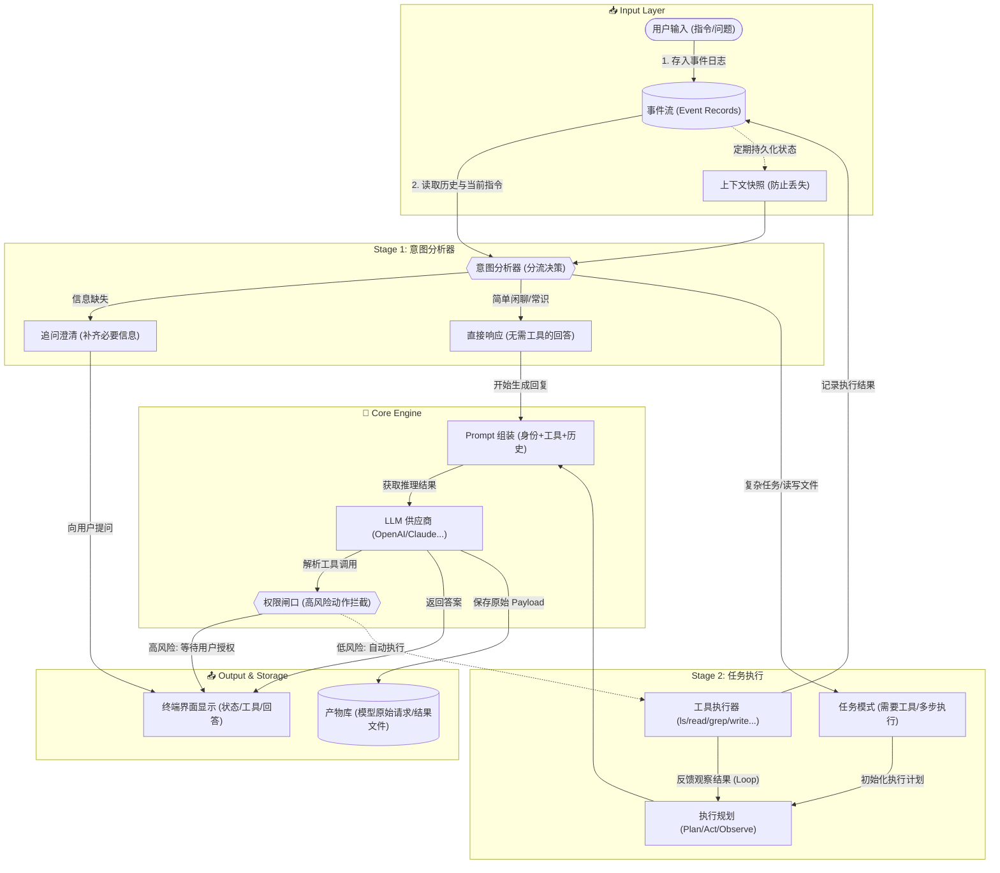

```mermaid
flowchart TD

    subgraph input_layer ["📥 Input Layer"]
        user_cmd(["用户输入 (指令/问题)"])
        event_store[("事件流 (Event Records)")]
        context_snap["上下文快照 (防止丢失)"]
    end

    subgraph stage1 [" Stage 1: 意图分析器"]
        router{{"意图分析器 (分流决策)"}}
        clarify["追问澄清 (补齐必要信息)"]
        direct_reply["直接响应 (无需工具的回答)"]
    end

    subgraph stage2 [" Stage 2: 任务执行"]
        task_entry["任务模式 (需要工具/多步执行)"]
        planner["执行规划 (Plan/Act/Observe)"]
        tool_exec["工具执行器 (ls/read/grep/write...)"]
    end

    subgraph core_engine ["🤖 Core Engine"]
        prompt_factory["Prompt 组装 (身份+工具+历史)"]
        llm_engine["LLM 供应商 (OpenAI/Claude...)"]
        risk_gate{{"权限闸口 (高风险动作拦截)"}}
    end

    subgraph output_storage ["📤 Output & Storage"]
        ui_display["终端界面显示 (状态/工具/回答)"]
        artifact_db[("产物库 (模型原始请求/结果文件)")]
    end

    user_cmd -->|"1. 存入事件日志"| event_store
    event_store -->|"2. 读取历史与当前指令"| router
    event_store -.->|"定期持久化状态"| context_snap
    context_snap --> router

    router -->|"信息缺失"| clarify
    router -->|"简单闲聊/常识"| direct_reply
    router -->|"复杂任务/读写文件"| task_entry

    clarify -->|"向用户提问"| ui_display
    direct_reply -->|"开始生成回复"| prompt_factory

    task_entry -->|"初始化执行计划"| planner
    planner --> prompt_factory
    prompt_factory -->|"获取推理结果"| llm_engine
    llm_engine -->|"解析工具调用"| risk_gate

    risk_gate -->|"高风险: 等待用户授权"| ui_display
    risk_gate -.->|"低风险: 自动执行"| tool_exec

    tool_exec -->|"反馈观察结果 (Loop)"| planner
    tool_exec -->|"记录执行结果"| event_store

    llm_engine -->|"返回答案"| ui_display
    llm_engine -->|"保存原始 Payload"| artifact_db
```
