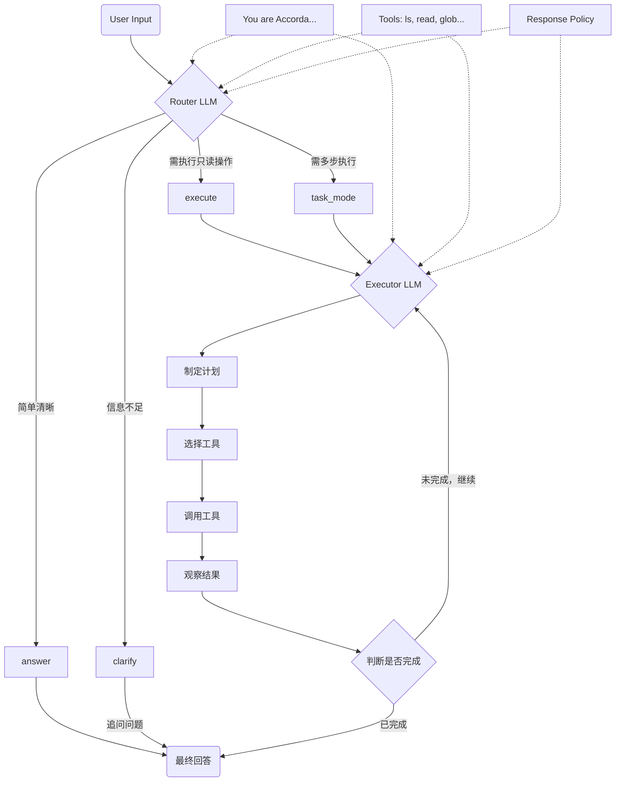

# 双层工具循环 - 大模型视角 (Mermaid)

```mermaid
flowchart TB

    %% 用户输入
    user_input("User Input")

    %% 路由判断
    stage1_llm{"Router LLM"}
    decision_answer["answer"]
    decision_execute["execute"]
    decision_clarify["clarify"]
    decision_task["task_mode"]

    %% 执行循环
    stage2_llm{"Executor LLM"}
    plan["制定计划"]
    choose_tool["选择工具"]
    call_tool["调用工具"]
    observe["观察结果"]
    decide{"判断是否完成"}
    final_answer("最终回答")

    %% Prompt 组成
    tools["Tools: ls, read, glob..."]
    identity["You are Accorda..."]
    policy["Response Policy"]

    %% 连线
    user_input --> stage1_llm

    stage1_llm -->|"简单清晰"| decision_answer
    stage1_llm -->|"信息不足"| decision_clarify
    stage1_llm -->|"需执行只读操作"| decision_execute
    stage1_llm -->|"需多步执行"| decision_task

    decision_answer --> final_answer
    decision_clarify -->|"追问问题"| final_answer

    decision_execute --> stage2_llm
    decision_task --> stage2_llm

    stage2_llm --> plan
    plan --> choose_tool
    choose_tool --> call_tool
    call_tool --> observe
    observe --> decide
    decide -->|"未完成，继续"| stage2_llm
    decide -->|"已完成"| final_answer

    identity -.-> stage1_llm
    identity -.-> stage2_llm
    tools -.-> stage1_llm
    tools -.-> stage2_llm
    policy -.-> stage1_llm
    policy -.-> stage2_llm
```
