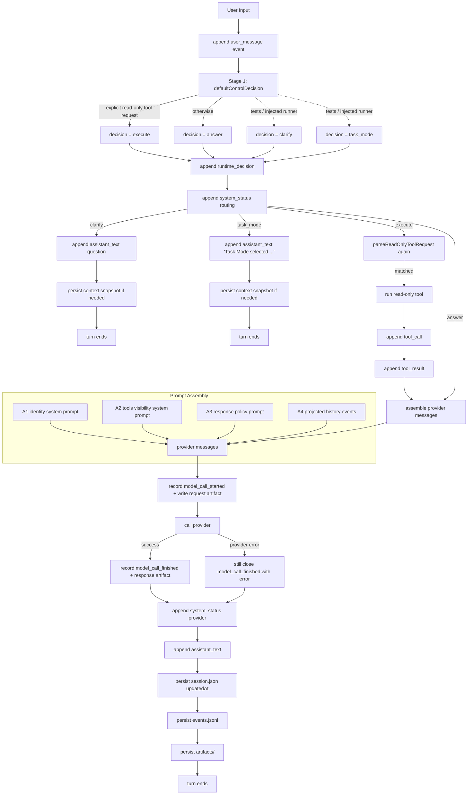

```mermaid
flowchart TD
    U[User Input] --> E1[append user_message event]
    E1 --> R1[Stage 1: defaultControlDecision]

    R1 -->|explicit read-only tool request| D1[decision = execute]
    R1 -->|otherwise| D2[decision = answer]
    R1 -. tests / injected runner .-> D3[decision = clarify]
    R1 -. tests / injected runner .-> D4[decision = task_mode]

    D1 --> L1[append runtime_decision]
    D2 --> L1
    D3 --> L1
    D4 --> L1

    L1 --> L2[append system_status routing]

    L2 -->|clarify| C1[append assistant_text question]
    C1 --> CS1[persist context snapshot if needed]
    CS1 --> END1[turn ends]

    L2 -->|task_mode| T1[append assistant_text 'Task Mode selected ...']
    T1 --> CS2[persist context snapshot if needed]
    CS2 --> END2[turn ends]

    L2 -->|execute| X1[parseReadOnlyToolRequest again]
    X1 -->|matched| X2[run read-only tool]
    X2 --> X3[append tool_call]
    X3 --> X4[append tool_result]
    X4 --> P0

    L2 -->|answer| P0[assemble provider messages]

    subgraph Prompt Assembly
      A1[A1 identity system prompt]
      A2[A2 tools visibility system prompt]
      A3[A3 response policy prompt]
      A4[A4 projected history events]
      A1 --> B[provider messages]
      A2 --> B
      A3 --> B
      A4 --> B
    end

    P0 --> B
    B --> P1[record model_call_started + write request artifact]
    P1 --> P2[call provider]
    P2 -->|success| P3[record model_call_finished + response artifact]
    P2 -->|provider error| P4[still close model_call_finished with error]

    P3 --> P5[append system_status provider]
    P4 --> P5
    P5 --> P6[append assistant_text]
    P6 --> S1[persist session.json updatedAt]
    S1 --> S2[persist events.jsonl]
    S2 --> S3[persist artifacts/]
    S3 --> END3[turn ends]
```